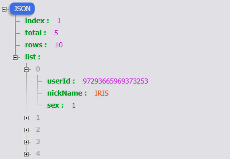

# easypage
非常简洁的mybatis分页插件，支持MySQL，Oracle数据库。

# 使用教程

### 一、pom.xml中添加依赖

```
<dependency>
   <groupId>com.github.ethendev</groupId>
   <artifactId>easypage</artifactId>
   <version>1.0.1</version>
 </dependency>
```

### 二、配置plugins
如果是SpringMVC项目, 在mybatis-config.xml中添加如下代码：
```
<?xml version="1.0" encoding="UTF-8" ?>
<!DOCTYPE configuration PUBLIC "-//mybatis.org//DTD Config 3.0//EN" "mybatis-3-config.dtd">
<configuration>

  <settings>
      <setting name="logImpl" value="SLF4J"/>
  </settings>
  <!-- mybatis-config.xml -->
  <plugins>
      <plugin interceptor="com.github.ethendev.PageInterceptor" />
  </plugins>

</configuration>
```

如果是Spring Boot项目，在SqlSessionFactory的配置中添加plugins

````
@Bean(name = "sqlSessionFactory")
public SqlSessionFactory sqlSessionFactoryBean() throws Exception {
    SqlSessionFactoryBean bean = new SqlSessionFactoryBean();
    bean.setDataSource(dataSource);

    //添加分页插件
    PageInterceptor easypage = new PageInterceptor();
    bean.setPlugins(new Interceptor[]{easypage});

    try {
        ResourcePatternResolver resolver = new PathMatchingResourcePatternResolver();
        bean.setMapperLocations(resolver.getResources("classpath*:mapper/*Mapper.xml"));
    } catch (Exception e) {
        e.printStackTrace();
    }
    return bean.getObject();
}
``````

### 三、mapper中传入 PageParam分页参数，返回值为 Page，插件就会自动对其进行分页。

```
@Mapper
public interface UserMapper {
    Page<UserVo> getList(PageParam page) throws Exception;
}
```

```
@RequestMapping(value = "/getAll", method = RequestMethod.GET)
public PageResult getAll(PageParam page) throws Exception {
    Page<UserVo> list = mapper.getList(page);
    PageResult ret = new PageResult(list);
    return ret;
}
```

访问http://127.0.0.1:8080/user/getAll?index=1&rows=10，得到分页结果如下：


### 四、常见问题

1、 配置正确，但是没有分页

* PageParam参数中index默认为0， rows默认为Integer.MAX_VALUE，只要有一个参数为默认值时都不会分页。
* index从1开始计数，表示第一页。

2、 是否需要配置数据库类型
* 不需要配置，插件会根据数据库元数据自动识别数据库类型。